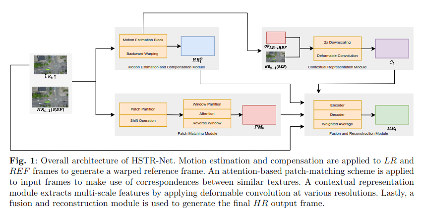
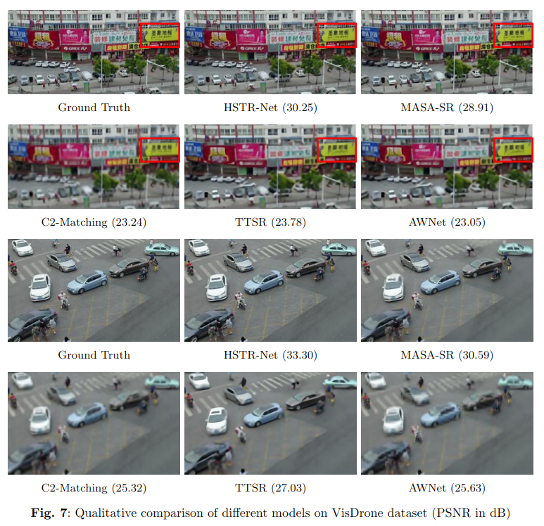
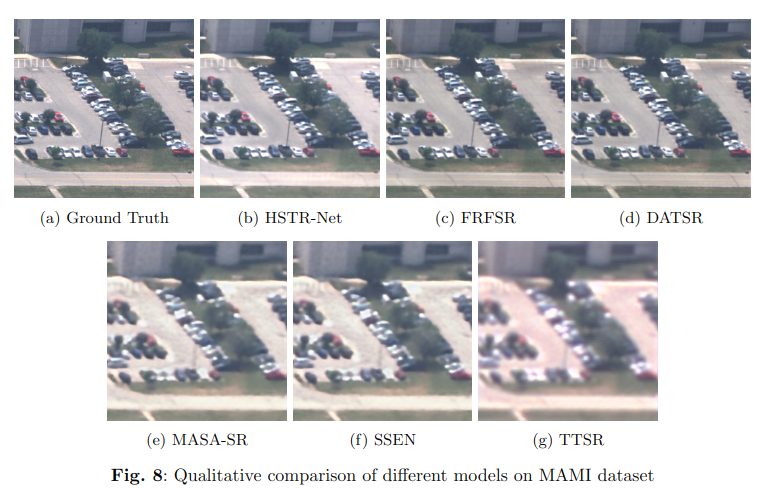

# HSTR-Net: Reference Based Video Super-resolution with Dual Cameras

**Authors:** [H. Umut Suluhan](), [Abdullah Enes Doruk](), [Hasan F. Ates](), and [Bahadir K. Gunturk]()


[](https://arxiv.org/pdf/2310.12092)
[](https://github.com/umutsuluhan/HSTRNet)


This repository is the official PyTorch implementation of "HSTR-Net: Reference Based Video Super-resolution with Dual Cameras"

<p align="center">
  
</p>


## Abstract 
High-spatio-temporal resolution (HSTR) video recording plays a crucial role in enhancing various imagery tasks that require fine-detailed information. State-of-the-art cameras provide this required high frame-rate and high spatial resolution together, albeit at a high cost. To alleviate this issue, this
paper proposes a dual camera system for the generation of HSTR video using reference-based superresolution (RefSR). One camera captures high spatial resolution low frame rate (HSLF) video while the other captures low spatial resolution high frame rate (LSHF) video simultaneously for the same scene.
A novel deep learning architecture is proposed to fuse HSLF and LSHF video feeds and synthesize HSTR video frames. The proposed model combines optical flow estimation and (channel-wise and spatial) attention mechanisms to capture the fine motion and complex dependencies between frames of the two video feeds. Simulations show that the proposed model provides significant improvement over existing reference-based SR techniques in terms of PSNR and SSIM metrics. The method also exhibits sufficient frames per second (FPS) for aerial monitoring when deployed on a power-constrained drone equipped with dual cameras.


#### Contents

1. [Installation](#Requirements)
1. [Datasets](#Datasets)
1. [Checkpoints](#Checkpoints)
1. [Training](#Training)
1. [Results](#Results)
1. [Citation](#Citation)


## Installation 

 - Python 3.8, PyTorch >= 1.7.1
 - CUDA 11.x

**a.** Create environment
```Shell
conda env create -f environment.yml
```

**b.** Activate environment
```Shell
conda activate hstrnet
```

## Datasets 
Downloads [Vimeo](), [Vizdrone](), and [MAMI]() datasets.

```
HSTRNet
    ├── data/vimeo
            ├── sequences
            ├── tri_testlist.txt
            ├── tri_trainlist.txt
            ├── vimeo_triplet_lr
            ├── x4_downsampled_sequences
            └── x8_downsampled_sequences
        data/vizdrone
            ├── normal
            └── upsampled
        data/MAMI
            ├── test
            ├── train
```

## Checkpoints 

* By default, we assume you have downloaded the file in the `pretrained` dir.
* For Downloading all checkpoints, you can run `pretrained.sh`.

```Shell
bash pretrained.sh
```

| Dataset | PSNR | Ifnet | Unet | Attention | Contextnet |
|:----:|:----:|:----:|:----:|:----:|:----:|
| **Vimeo** | 38.45 | [Link](https://arizona.box.com/shared/static/l0dclotorf4fgoiruhztqx26btgb3wbz.pkl) | [Link](https://arizona.box.com/shared/static/96lcnmtn1zrha2y7el7940gqg3r191l0.pkl) | [Link](https://arizona.box.com/shared/static/47yzmk4k869hqszoyegdnc6vi4jccc2r.pkl) | [Link](https://arizona.box.com/shared/static/pkpgzlr75jdh1s3ydpr2mfwleobtka4k.pkl) |
| **Vizdrone** | 33.30 | [Link](https://arizona.box.com/shared/static/st33vv9jwy0q4idmw7gklwpai7ficz7a.pkl) | [Link](https://arizona.box.com/shared/static/n5f48m4jwsrwrobxb8agkikj7fuvz1n3.pkl) | [Link](https://arizona.box.com/shared/static/e7g4i6brrfwneofdkquhk8ldbct1pn6i.pkl) | [Link](https://arizona.box.com/shared/static/3hoypnyapsj6i9v6pbxwfq3dftozg1a8.pkl) |
| **MAMI** | 25.34 | [Link](https://arizona.box.com/shared/static/w7lv57tpgnq3vfnx70qfltn7x9q9ffuv.pkl) | [Link](https://arizona.box.com/shared/static/52flk4jpn1smup3czvlc960zee6brhdb.pkl) | [Link](https://arizona.box.com/shared/static/s4pl3mye7ppsl1y4c1vyq04alr6ztntc.pkl) | [Link](https://arizona.box.com/shared/static/0ndhegx501lsj1hgowm8oksa5drwi65l.pkl) |


## Training 

**a. Vimeo Training**
```Shell
python train/vimeo.py --dataset data/vimeo --epoch 100 --lr 0.0001 --train_bs 16 --val_bs 4 --workers 4
```
**b. Vizdrone Training**
```Shell
python train/vizdrone.py --dataset data/vizdrone --epoch 100 --lr 0.0001 --train_bs 16 --val_bs 4 --workers 4
```


**c. MAMI Training**
```Shell
python train/mami.py --dataset data/MAMI --epoch 100 --lr 0.0001 --train_bs 16 --val_bs 4 --workers 4
```


## Results
<p align="center">
  
</p>
<p align="center">
  
</p>


## Citation
```
@article{suluhan2023hstr,
    title={HSTR-Net: Reference Based Video Super-resolution for Aerial Surveillance with Dual Cameras},
    author={Suluhan, H Umut and Ates, Hasan F and Gunturk, Bahadir K},
    journal={arXiv preprint arXiv:2310.12092},
    year={2023}
}
```